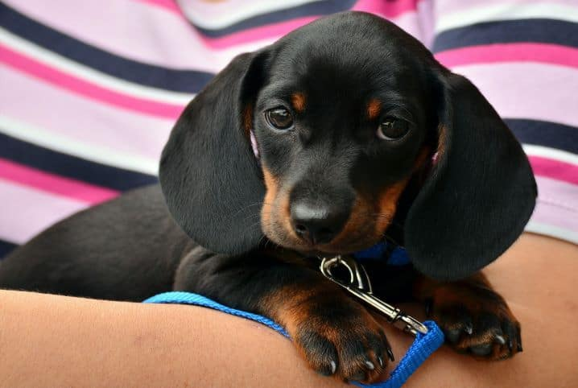

# Parte 4 - Links e Imagens

Este repositório contém a resolução da Parte 4 do Exercício 1.

## Como corrigir uma imagem quebrada no HTML?

Se uma imagem não estiver carregando na página (aparecendo aquele ícone de imagem quebrada), eu seguiria os seguintes passos para corrigir:

1. **Verificar o caminho (src):** Garantir que a rota até a imagem está certa. Como a imagem está dentro da pasta `img`, o caminho correto deve começar com `img/nome-da-imagem.extensao`.
2. **Verificar o nome exato do arquivo:** O HTML diferencia letras maiúsculas de minúsculas. Se a imagem se chamar `Foto.PNG` e no código estiver `foto.png`, ela vai quebrar.
3. **Verificar a extensão do arquivo:** Confirmar se o formato é realmente `.png`, `.jpg`, `.jpeg` ou `.svg`.
4. **Garantir o uso do atributo `alt`:** Caso a imagem quebre por problemas de conexão do usuário, o texto alternativo descritivo configurado no `alt` aparecerá no lugar, mantendo a acessibilidade do site.